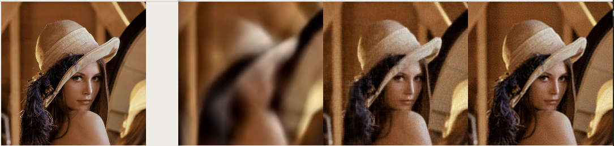
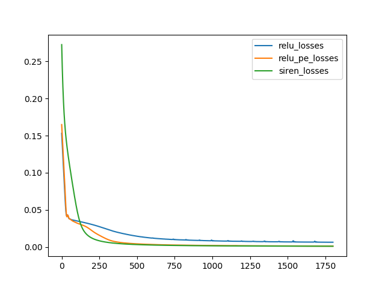

## SIREN and Position Encoding 2D

This project tries to reproduce some toy experiences introduced in [SIREN](https://arxiv.org/abs/2006.09661). SIREN introduces a new type of network that uses periodic activation functions (sin() in the paper) to improve the high-frequency details of reconstructed 2D signals (e.g. images), 3D signals (e.g. SDF field).

In this project, we compare SIREN with vanilla fully-connected networks and position encoded networks (introduced in [NERF](http://www.matthewtancik.com/nerf)) in 2D reconstructions. Specifically, we test the performance of image reconstruction via intensity supervision and gradient supervision.

## Models

Models are provided in '''models.py'''. Additionally, we provide analytic gradient calculation w.r.t. to the input. The gradient calculation is tested using numerical methods.

## Reconstruct via intensity supervision

The script '''test_image_fitting''' provides such comparision.

Below is the image fit result with 1750 steps. From left to right is the target, relu, relu with position encoding, and siren.



Below is the intensity error during the fit.




## Reconstruct via numerical gradient supervision

The script '''test_grad_fitting_numerical''' provides such comparison. During the training, we first inference the image and calculate the numerical gradient using adjacent pixel values. Training loss is calculated by comparing the numerical gradient with the ground truth gradient. Visually, SIREN generates more visually pleasing results.

## Reconstruct via analytic gradient supervision

The script '''test_grad_fitting_analytic''' provides such comparison. During the training, we directly calculate the image gradient analytically and compare it with the ground truth. However, I cannot make it converge :(. Maybe I missed some important parts in the paper.

## Requirements

```
pytorch
opencv-python
python 2.7
```

## Reference


```
@misc{mildenhall2020nerf,
    title={NeRF: Representing Scenes as Neural Radiance Fields for View Synthesis},
    author={Ben Mildenhall and Pratul P. Srinivasan and Matthew Tancik and Jonathan T. Barron and Ravi Ramamoorthi and Ren Ng},
    year={2020},
    eprint={2003.08934},
    archivePrefix={arXiv},
    primaryClass={cs.CV}
}


@misc{mildenhall2020nerf,
    title={Implicit Neural Representations with Periodic Activation Functions},
    author={Vincent Sitzmann and Julien N. P. Martel and Alexander W. Bergman and David B. Lindell and Gordon Wetzstein},
    year={2020},
    eprint={2006.09661},
    archivePrefix={arXiv},
    primaryClass={cs.CV}
}
```